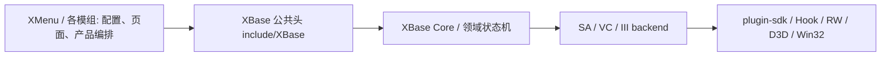

# XBase

XBase 是 GTA SA / VC / III 的底层能力库。

它负责游戏版本后端、plugin-sdk 访问、Hook、渲染、输入、网页视图、运行时生命周期与平台 I/O；上层模组只应通过 `include/XBase` 的公共值类型与语义 API 使用它。

## 边界



- 公共头：`include/XBase/*.h`，`XBase.h` 聚合全部头
- 私有实现：`src/controllers/`、`src/backends/`
- 宿主只能 include `include/XBase`，不得引用 `XBase/src`、plugin-sdk、ImGui、D3D 或裸地址
- `XBaseSA` / `XBaseVC` / `XBaseIII` 必须按游戏版本分别链接，禁止交叉使用

不属于 XBase 的内容：具体模组的业务编排、数据内容与界面文案，这些归各自模组。

## 前置条件

- Windows x86 工具链，Visual Studio C++ Desktop Development
- Premake 5：优先使用 `tools/premake5.exe`
- plugin-sdk：设置 `PLUGIN_SDK_DIR`，或在相邻目录提供 `../plugin-sdk`
- 工程固定 C++20、Win32 / x86、静态运行库 `/MT`，MBCS

面板前端还需要 Node.js，只在改 `panel/` 时才用得到。

## 构建

```bat
Build.bat Release --no-pause
```

批处理文件必须保持 CRLF 行尾，`cmd` 在 LF 下会找不到 `call :label` 标签。仓库用 `.gitattributes` 固定 `*.bat` 为 CRLF，本地被改成 LF 就重新检出或换行尾。

| 参数 | 说明 |
| --- | --- |
| `Release` / `Debug` | 构建配置，默认 Release |
| `--toolset v143` | 覆盖平台工具集，默认 `v145` |
| `--no-pause` | 结束不暂停，适合 CI 与脚本调用 |

构建产出：

| 产物 | 职责 |
| --- | --- |
| `XBaseBootstrap.lib` | 加载器 asi 入口，含地址探测与共享库引导 |
| `XBasePayloadEntry.lib` | 两段式形态下 payload dll 的入口 |
| `XBaseRuntimeEntry.lib` | `XBase.asi` 入口，只引导共享运行时 |
| `XBaseModEntry.lib` | 单文件 asi 入口，引导后直接跑本模块业务 |
| `XBaseSA.lib` / `XBaseVC.lib` / `XBaseIII.lib` | 按版本的静态后端 |
| `XBaseSA.dll` / `XBaseVC.dll` / `XBaseIII.dll` | 共享运行时，仅 Release 构建 |

共享运行时只出 Release：plugin-sdk 的 `output/lib` 只有 Release 库，Debug 链接会因运行库与迭代器调试级别不匹配失败。

Release 构建成功后会自动 stage：

```text
../XMenu/include/XBase/*.h        相邻宿主存在时同步
../XMenu/lib/XBase*.lib
../III.VC.SA.WebView2/...
example/include/XBase/*.h         示例骨架共用同一份 SDK
example/lib/*.lib
build/bin/Release/XBase/Library/panel/   通用面板前端
```

同步只在全部 Release 目标通过产物核验后执行，不会用旧库顶替缺失库。

## 发布形态

XBase 一次安装，此后**每个模组只发一个 `<mod>.asi`**，同一个文件在三个游戏版本上通用，版本差异由 Bootstrap 加载的 `XBase{ver}.dll` 承担。

asi 由 Ultimate ASI Loader 加载，位置维持游戏的 `plugins\<mod>{SA,VC,III}.asi`。这个位置不挪：XBase 的显示模式预设必须在游戏创建 D3D 设备**之前**跑，只有加载器的加载时机能满足，任何「XBase 自扫目录再加载 asi」都会来得太晚。

## 目录约定

```text
GameRoot/
├─ plugins/
│  └─ <mod>SA.asi / <mod>VC.asi / <mod>III.asi
└─ XBase/
   ├─ Library/                  公用二进制，所有模组共用
   │  ├─ XBaseSA.dll / XBaseVC.dll / XBaseIII.dll
   │  ├─ WebView2Loader.dll
   │  └─ panel/                 通用面板前端
   └─ Mods/
      └─ <mod>/                 该模组自己的一切
         ├─ package.json        模组清单，挂载前校验
         ├─ config.json
         ├─ debug.log
         ├─ data/
         └─ ui/
```

`Library\` 放公用二进制，`Mods\<mod>\` 放模组数据，两者不混。目录名由模组导出的 `XBasePayloadBaseName()` 决定，不带游戏后缀。

`Platform::ModDirectory()` 带建目录副作用，只读路径不要用它。

## 模组接入

四个导出缺一不可，且必须带 `__declspec(dllexport)`，只写 `extern "C"` 不会真正导出：

```cpp
extern "C" __declspec(dllexport) const char* XBasePayloadBaseName();   // 基名，决定目录名
extern "C" __declspec(dllexport) const char* XBaseModTargetGame();     // "SA" / "VC" / "III"
extern "C" __declspec(dllexport) void XBasePayloadAttach();
extern "C" __declspec(dllexport) void XBasePayloadDetach();
```

不导出基名时 Bootstrap 会按 asi 文件名推导，把 `MyModVC.asi` 推成 `MyModVC`，目录名、载荷名、清单校验三处会一起错。

单文件 asi 形态的 premake 写法：

```lua
links { "XBaseModEntry", "XBase" .. upperID, "Plugin" .. upperID }
linkoptions { "/WHOLEARCHIVE:XBaseModEntry.lib" }
```

`/WHOLEARCHIVE` 是必需的：入口只由系统加载时调用，静态链接器不会因为普通符号引用而自动选择包含 `DllMain` 的对象文件。

入口库是整包拉入的，**必须自足**：`Bootstrap.cpp` 用到的 `Package.cpp` / `Json.cpp` / `Platform.cpp` 由 premake 的 `ENTRY_SUPPORT_SOURCES` 一起编进来。往 `Bootstrap.cpp` 里引新的 controller 时要同步这份清单，否则只链入口库的宿主会 LNK2019，而 XBase 自身构建不报错。

## 模组清单 package.json

Bootstrap 在挂载模组**之前**读清单做约束校验，不满足就拒绝挂载并弹出原因。

| 字段 | 作用 |
| --- | --- |
| `name` | 显示名 |
| `version` / `author` / `description` / `license` / `homepage` | 元信息 |
| `engines.xbase` | 所需 XBase 版本区间 |
| `dependencies` | 依赖声明，能对应到其它模组的按版本校验，对应不到的是第三方运行库，只声明不校验 |

清单不存在时按无约束放行，不报错，但同时也失去了保护。

## 共享运行时与 ABI

进程内只加载一份 `XBase{ver}.dll`，所有模组共用同一套 Hooks、ImGui 上下文、输入键态与配置。契约在 `include/XBase/Abi.h`：

- 唯一导出 `xbaseGetRuntime(uint32 abiVersion)` 返回函数指针表
- 字段只追加不改，调用方用 `size` 判断新字段是否存在
- 字符串一律由调用方提供缓冲区
- 回调用 `void(*)(void*)` 加 `userData`

XBase 用 `/MT`，跨模块传 `std::string` / `std::function` / `std::vector` 会因 CRT 堆不匹配崩溃，所以 ABI 上只有 C 风格类型。

## 通用面板

XBase 自带一个 React 面板（`XBase\Library\panel\`），模组只描述界面并挂钩子，不写前端。多个模组聚合到同一个侧栏上。

```cpp
XBase::Panel::Mount(spec);                       // 模组 / 页面 / 分区 / 控件
XBase::Panel::BindValue("mymod.godMode", read, write);
XBase::Panel::BindAction("mymod.reset", run);
XBase::Panel::SetHotkey(XBase::Input::Hotkey{XBase::Input::Key::F7, 0});
```

值统一用 `double`：开关读写 0 与 1，下拉读写的是 `options` 下标。面板状态归共享运行时，所以各模组看到的是同一份注册表。

前端在 `XBase/panel/`，改完执行：

```bash
cd panel && npm install && npm run build
```

## 示例骨架

`example/` 下四份可以直接拷出来改的骨架，都是单文件 asi 形态：

| 目录 | 演示内容 |
| --- | --- |
| `01-hello` | 生命周期注册、日志、游戏内提示 |
| `02-menu` | 界面绘制、配置持久化、热键、每帧状态推送 |
| `03-webui` | 本地页面映射、原生方法注册、页面反向调用 |
| `04-panel` | 挂进通用面板，零前端代码 |

每份都带 `data/package.json`。SDK 由 XBase 的 `Build.bat` 统一 stage，四个示例共用同一份。细节见 `example/README.md`。

## 能力矩阵

各后端实现的 `Capability` / `FeatureCapability` 支持级别，与 `src/controllers/Capabilities.cpp` 保持一致。

图例：✅ Supported（可用）　◐ Partial（部分可用）　✖ Unsupported（未实现）

### 粗粒度 Capability

| Capability | SA | VC | III |
| --- | :-: | :-: | :-: |
| Player | ✅ | ◐ | ◐ |
| Ped | ◐ | ◐ | ◐ |
| Vehicle | ✅ | ◐ | ◐ |
| Weapon | ✅ | ◐ | ◐ |
| World | ◐ | ◐ | ◐ |
| Visual | ✅ | ◐ | ◐ |
| Teleport | ✅ | ◐ | ◐ |
| Scene | ◐ | ◐ | ◐ |
| Camera | ✅ | ✖ | ✖ |
| Cheats | ✅ | ◐ | ◐ |
| VehicleEffects | ✅ | ✖ | ✖ |
| BulletAssist | ◐ | ◐ | ◐ |
| Hooks | ✅ | ✅ | ✅ |
| Ui | ✅ | ✅ | ✅ |
| WebView | ✅ | ✅ | ✅ |
| Panel | ✅ | ✅ | ✅ |
| Overlay | ◐ | ◐ | ◐ |

### FeatureCapability

#### 玩家 / 行人

| Feature | SA | VC | III |
| --- | :-: | :-: | :-: |
| PlayerBasicState | ✅ | ✅ | ✅ |
| PlayerRuntimeEffects | ✅ | ◐ | ◐ |
| PlayerProofs | ✅ | ✅ | ✅ |
| PlayerMovement | ✅ | ✅ | ✅ |
| PlayerAppearance / Clothes / Stats / SuperJump / SuperPunch / UnderwaterBreathing / CycleJump / NeverHungry / FastSprint / SprintEverywhere / DrunkEffect / NeverWanted / AimSkinChanger / KeepStuff / SaveGame | ✅ | ✖ | ✖ |
| PedBasic / Spawn / Delete / Attributes / Classification | ✅ | ✅ | ✅ |
| PedBigHead | ✅ | ✖ | ✅ |
| PedThinBody / SmokeFlies | ✅ | ✖ | ✖ |
| PedMarkerSpawn / GlobalStrategies | ◐ | ✖ | ✖ |

#### 载具

| Feature | SA | VC | III |
| --- | :-: | :-: | :-: |
| VehicleBasic | ✅ | ◐ | ◐ |
| VehicleColors | ✅ | ◐ | ◐ |
| VehicleDoors / Spawn / SpawnSession / Delete / Events | ✅ | ✅ | ✅ |
| VehiclePopDoors / AlwaysSkidMarks / DisableParticles / DriverTargetable / HeatSeekingTargetable / PetrolTankWeakPoint / SirenOrAlarm / TakeLessDamage / TrafficDensity / AutoDrive / Paintjob / Upgrades | ✅ | ✖ | ✖ |
| VehicleCheats | ✅ | ◐ | ◐ |

#### 世界

| Feature | SA | VC | III |
| --- | :-: | :-: | :-: |
| WorldTime / Weather / Gravity / GameSpeed / FpsLimit / DaysPassed / FreezeTime / FasterClock / DisableReplay / DisableCheats | ✅ | ✅ | ✅ |
| WorldPickups | ✅ | ◐ | ◐ |
| WorldForbiddenAreaWanted / FreePayNSpray / NoWaterPhysics / SolidWater | ✅ | ✖ | ✖ |

#### 武器 / 传送 / 视觉

| Feature | SA | VC | III |
| --- | :-: | :-: | :-: |
| WeaponBasic / Give / Drop | ✅ | ✅ | ✅ |
| WeaponRuntimeEffects / StatOverrides | ✅ | ✅ | ✅ |
| WeaponSkills | ✅ | ✖ | ✖ |
| TeleportBasic | ✅ | ✅ | ✅ |
| VisualHudRadar / VisualFilter | ✅ | ✅ | ✅ |
| VisualRadarOptions | ✅ | ✖ | ✖ |

#### 场景 / 相机 / 作弊 / 载具特效

| Feature | SA | VC | III |
| --- | :-: | :-: | :-: |
| SceneAnimation / SceneMission | ✅ | ✖ | ✖ |
| SceneParticle / SceneCutscene | ◐ | ✖ | ✖ |
| CameraFreecam / CameraTopDown | ✅ | ✖ | ✖ |
| CheatsRandom | ✅ | ✖ | ✖ |
| VehicleEffectsNeon | ✅ | ✖ | ✖ |

#### BulletAssist

| Feature | SA | VC | III |
| --- | :-: | :-: | :-: |
| BulletAssistTracking / ThroughWalls / HardLock | ✅ | ✅ | ✖ |
| BulletAssistPedBounds / VehicleBounds | ✅ | ✅ | ✅ |
| BulletAssistPedCollision / PedSkeleton / VehicleCollision / FireSuppression | ◐ | ◐ | ✖ |

> 说明：以上矩阵由 `Capabilities.cpp` 静态声明，运行时以实际后端行为为准；`Partial` 表示页面或接口可用，但部分动作受限（如 VC/III 的 `WorldPickups` 走脚本指令路径、`PlayerRuntimeEffects` 仅覆盖部分开关）。
> `Overlay` 与 `Scene` 在 VC/III 为 `Partial`：覆盖层已改为走 ImGui 画布的三版本共用实现，场景仅任务相关接口可用。III 的 `BulletAssist` 只提供边界框这类只读显示，追踪与开火抑制需要挂钩地址，仍未实现。`VehicleEffects` 是 SA 专属能力，这是设计如此而非尚未实现。

## 配置一致性

- Release 宿主只能链 Release 库，Debug 链 Debug，禁止混链
- 禁止混用 x86 / x64，或不同源码版本的头文件与 `.lib`
- 更新 XBase 后必须重新构建并同步，二者必须同源

## 排查路径

| 现象 | 优先检查 |
| --- | --- |
| MSB6001「已添加项。字典中的关键字 HTTPS_PROXY」 | 环境注入了大小写重复代理变量，构建前 `unset http_proxy https_proxy HTTP_PROXY HTTPS_PROXY` |
| `build\bin\*.lib` 没产出 | 看构建日志里哪个目标失败；Release 才有共享运行时 dll |
| 启动弹 Failed to detect | 游戏版本不支持，或 asi 放错了目录 |
| 弹共享运行时加载失败 | `XBase\Library\XBase{ver}.dll` 缺失，重装 XBase |
| 弹 ABI 版本不符 | 模组与本库不同源，重新一起构建 |
| 数据目录名带版本后缀 | 没导出 `XBasePayloadBaseName`，被按文件名推导了 |
| 启动弹版本不满足 | `package.json` 的 `engines.xbase` 高于当前版本 |
| 只链入口库的宿主 LNK2019 | `Bootstrap.cpp` 引了新 controller，补 premake 的 `ENTRY_SUPPORT_SOURCES` |
| 面板打不开 | `XBase\Library\panel\index.html` 是否存在，机器上有没有 WebView2 运行时 |

日志在 `XBase\Mods\<模组名>\debug.log`，也可以用 XBase 自带的查看器打开。

## 文档

完整 API 说明在线上 https://blog.miomoe.cn/docs/xbase ，本地不保留文档副本。
